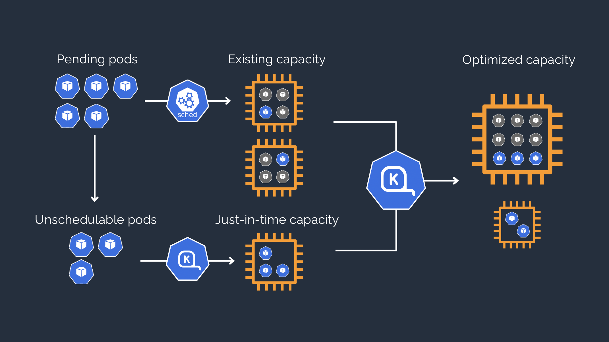
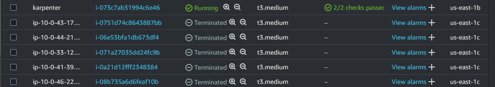

# EKS Cluster Autoscaler with Karpenter 

Karpenter is a cluster autoscaler that provisions nodes and add them to a running cluster. It makes decisions to add or remove nodes from the cluster based on the number of requests of unshedulable pods in the cluster. This node launch/terminate feature, minimizes scheduling latencies and infrastructure cost.

The diagram below gives an overview of how karpenter performs autoscaling on a cluster



## Repository Content

This repository contains terraform configurations that will provision a cluster on AWS EKS. The cluster begins as a single node (t3.medium) cluster. 

The terraform configuration proceeds to provision IAM roles, SQS queue for karpenter and all required resources needed to spin up karpenter. Furthermore, the repository installs karpenter helm chart on the EKS cluster providing you with a fully functional cluster with autoscaling using a single command.

## Node Pools
In this repo, after karpenter is provisioned using terraform, it then provisions a node pool that karpenter can use to implement autoscaling. The node pool contains configurations to add t3.medium/t2.micro SPOT instances when scaling.

## Scaling Demonstration
To demonstrate the cluster autoscaling, the repository create a deployment for the Almighty Pause Container [Details Here](https://www.ianlewis.org/en/almighty-pause-container). 
 The deployment image is a low level kubernetes container required to create pods on a node. This container only runs on a single node at a given time, so if you create 5 container replicas of this container, it will require 5 nodes to handle provisioning.

## Using The repository

To use this repository, you will need the following installed/Set up on your local machine
- Docker
- AWS CLI
- Terraform
- Kubectl 

NB: The repository logs into ECR public registry !!

Clone the repository on your local machine and in the repository's directory, execute the command below

```
terraform init
terraform validate
terraform apply --auto-approve
```
The last command will take roughly 20mins to be provisioned. Once this is complete and all resources are applied successfully, execute the command below to interact with the cluster on your local machine

```
aws eks update-kubeconfig --region us-east-1 --name ex-eks-karpenter
```

## Autoscaling in Action
 First confirm that karpenter resources are up and running

 ```
kubectl get pods -n kube-system
 ```

The output should look like the text below:
 ```
NAME                           READY   STATUS    RESTARTS   AGE
aws-node-tpj7h                 2/2     Running   0          9m1s
coredns-586b798467-75gdm       1/1     Running   0          13m
coredns-586b798467-842nr       1/1     Running   0          13m
eks-pod-identity-agent-w7mqq   1/1     Running   0          9m1s
karpenter-5c867c47c-pxxvk      1/1     Running   0          7m48s
karpenter-5c867c47c-zkpf6      0/1     Pending   0          7m48s
kube-proxy-v6bpj               1/1     Running   0          9m43s
 ```

 to test the autoscaler, scale up the pause container deployment to a number in my case, I used 5. So the end goal is karpenter will spin up 5 instances to schedule all the pause containers and will remove them when i scale down the deployment.

```
 kubectl scale deployment inflate --replicas 5
```

Karpenter wil then spin up 5 more nodes and join them to the cluster. So 5 new nodes including the default 1 node is 6 nodes in total.

```
NAME                          STATUS   ROLES    AGE    VERSION
ip-10-0-28-235.ec2.internal   Ready    <none>   15m    v1.30.2-eks-1552ad0
ip-10-0-33-122.ec2.internal   Ready    <none>   100s   v1.30.2-eks-1552ad0
ip-10-0-41-39.ec2.internal    Ready    <none>   34s    v1.30.2-eks-1552ad0
ip-10-0-43-173.ec2.internal   Ready    <none>   96s    v1.30.2-eks-1552ad0
ip-10-0-44-219.ec2.internal   Ready    <none>   35s    v1.30.2-eks-1552ad0
ip-10-0-46-226.ec2.internal   Ready    <none>   98s    v1.30.2-eks-1552ad0
```

To confirm nodes only spined up by karpenter, execute the command below. The output will return all nodes and specify nodes created by karpenter

```
kubectl get nodes -L karpenter.sh/registered
```

```
NAME                          STATUS   ROLES    AGE     VERSION               REGISTERED
ip-10-0-28-235.ec2.internal   Ready    <none>   17m     v1.30.2-eks-1552ad0   
ip-10-0-33-122.ec2.internal   Ready    <none>   3m33s   v1.30.2-eks-1552ad0   true
ip-10-0-41-39.ec2.internal    Ready    <none>   2m27s   v1.30.2-eks-1552ad0   true
ip-10-0-43-173.ec2.internal   Ready    <none>   3m29s   v1.30.2-eks-1552ad0   true
ip-10-0-44-219.ec2.internal   Ready    <none>   2m28s   v1.30.2-eks-1552ad0   true
ip-10-0-46-226.ec2.internal   Ready    <none>   3m31s   v1.30.2-eks-1552ad0   true
```
To scale down, remove all instances of the pause container using the command below:

```
kubectl scale deployment inflate --replicas 0
```

Removing the pause containers will cause karpenter to automatically and quickly scale down and delete all nodes that are unused by the cluster. You can see that only the inital node is now remaining.

```
NAME                          STATUS   ROLES    AGE   VERSION               REGISTERED
ip-10-0-28-235.ec2.internal   Ready    <none>   20m   v1.30.2-eks-1552ad0   
```



## Clean Ups

To clean up and remove all resources created by terraform, execute the command below to delete and remove all resources created.

```
terraform destroy --auto-approve
```